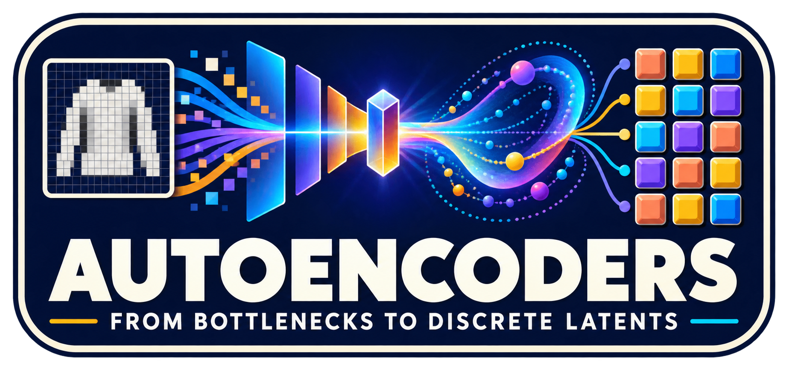
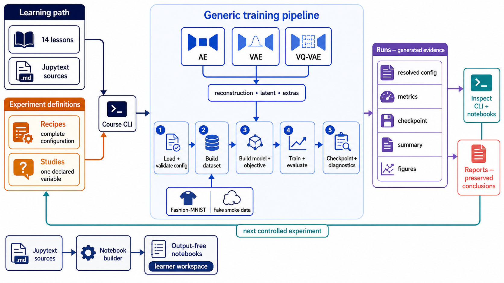

<div align="center">
  

  **🧪 Learn autoencoders by predicting, running, and inspecting experiments. 🧪**
</div>

Autoencoders: From Bottlenecks to Discrete Latents is an executable Python
course for learners and ML practitioners who want to understand AEs, VAEs, and
VQ-VAEs through evidence as well as theory. Work through 14 Jupyter lessons,
make one prediction, inspect one small experiment, and answer one transfer
check per lesson. Short CPU runs are reused automatically; derivations, full
sweeps, and research reports are optional.

The curriculum progresses from deterministic bottlenecks to continuous and
discrete latent spaces. Recipes define complete runs, studies vary one declared
factor, generated runs hold evidence, and reports preserve conclusions. Start
with the [course guide](course/README.md).

## Curriculum

Follow lessons 00–13 in order. Each notebook asks you to predict a result,
inspect one small experiment, and check your understanding. Math and larger
experiments are optional.

| Lesson / notebook | Colab | What you learn |
|---|---|---|
| [00 · See what an autoencoder does](course/notebooks/00-laboratory.ipynb) | [](https://colab.research.google.com/github/tsilva/course-aiml-autoencoders/blob/main/course/notebooks/00-laboratory.ipynb) | Follow an image through the encoder, bottleneck, and decoder; distinguish correct shapes from learned behavior. |
| [01 · Give reconstruction a reference](course/notebooks/01-mean-baseline.ipynb) | [](https://colab.research.google.com/github/tsilva/course-aiml-autoencoders/blob/main/course/notebooks/01-mean-baseline.ipynb) | Interpret pixel error and establish mean-image and black-image baselines. |
| [02 · Rebuild a garment from eight sliders](course/notebooks/02-linear-ae.ipynb) | [](https://colab.research.google.com/github/tsilva/course-aiml-autoencoders/blob/main/course/notebooks/02-linear-ae.ipynb) | Train a linear autoencoder, inspect its eight-dimensional bottleneck, and compare reconstruction with a baseline. |
| [03 · Let the reconstruction sheet bend](course/notebooks/03-capacity.ipynb) | [](https://colab.research.google.com/github/tsilva/course-aiml-autoencoders/blob/main/course/notebooks/03-capacity.ipynb) | See how nonlinear encoders and decoders change what a fixed-size bottleneck can represent. |
| [04 · Learn to remove noise](course/notebooks/04-regularized-ae.ipynb) | [](https://colab.research.google.com/github/tsilva/course-aiml-autoencoders/blob/main/course/notebooks/04-regularized-ae.ipynb) | Train with noisy inputs and measure recovery against clean targets. |
| [05 · Reconstruction does not choose new codes](course/notebooks/05-ae-geometry.ipynb) | [](https://colab.research.google.com/github/tsilva/course-aiml-autoencoders/blob/main/course/notebooks/05-ae-geometry.ipynb) | Compare latent interpolation with random sampling and explain why an AE needs a sampling rule. |
| [06 · Write a cloud of possible notes](course/notebooks/06-vae-control.ipynb) | [](https://colab.research.google.com/github/tsilva/course-aiml-autoencoders/blob/main/course/notebooks/06-vae-control.ipynb) | Introduce stochastic encoding and reparameterization with a VAE whose prior penalty is switched off. |
| [07 · Give the clouds a shared address system](course/notebooks/07-standard-vae.ipynb) | [](https://colab.research.google.com/github/tsilva/course-aiml-autoencoders/blob/main/course/notebooks/07-standard-vae.ipynb) | Use KL pressure toward a shared prior and inspect its effect on reconstruction and sampling. |
| [08 · Change the price of information](course/notebooks/08-rate-distortion.ipynb) | [](https://colab.research.google.com/github/tsilva/course-aiml-autoencoders/blob/main/course/notebooks/08-rate-distortion.ipynb) | Vary beta to explore the tradeoff between reconstruction error and the KL information cost. |
| [09 · Check whether the decoder uses the note](course/notebooks/09-collapse.ipynb) | [](https://colab.research.google.com/github/tsilva/course-aiml-autoencoders/blob/main/course/notebooks/09-collapse.ipynb) | Replace latent codes with zeros to diagnose whether the decoder uses them; recognize posterior collapse. |
| [10 · Snap notes to a learned vocabulary](course/notebooks/10-vqvae.ipynb) | [](https://colab.research.google.com/github/tsilva/course-aiml-autoencoders/blob/main/course/notebooks/10-vqvae.ipynb) | Quantize continuous features into VQ-VAE tokens and distinguish reconstruction from generation. |
| [11 · Count the symbols actually used](course/notebooks/11-codebook.ipynb) | [](https://colab.research.google.com/github/tsilva/course-aiml-autoencoders/blob/main/course/notebooks/11-codebook.ipynb) | Interpret codebook usage, dead codes, and perplexity rather than relying on nominal vocabulary size. |
| [12 · Learn which token arrangements belong together](course/notebooks/12-code-prior.ipynb) | [](https://colab.research.google.com/github/tsilva/course-aiml-autoencoders/blob/main/course/notebooks/12-code-prior.ipynb) | Train a conditional token prior, compare uniform and frequency baselines, and distinguish prediction from sampling. |
| [13 · Choose a representation for a task](course/notebooks/13-synthesis.ipynb) | [](https://colab.research.google.com/github/tsilva/course-aiml-autoencoders/blob/main/course/notebooks/13-synthesis.ipynb) | Choose between AE, VAE, and VQ-VAE mechanisms and identify the evidence needed to support that choice. |

<details>
<summary>Colab setup — run once in each new session before the lesson cells</summary>

Choose a CPU runtime with Python 3.11 or 3.12 under **Runtime → Change runtime
type**. Colab's [runtime version guide](https://research.google.com/colaboratory/runtime-version-faq.html)
lists compatible versions; `2026.07` provides Python 3.12. Copy this into a new
code cell above the lesson's first code cell and run it:

```python
import os
from pathlib import Path
import subprocess
import sys

if not (3, 11) <= sys.version_info[:2] < (3, 13):
    raise RuntimeError("Select a Colab runtime with Python 3.11 or 3.12, then rerun this cell.")

course_root = Path("/content/course-aiml-autoencoders")
if not course_root.exists():
    subprocess.run([
        "git", "clone", "--depth", "1", "--branch", "main",
        "https://github.com/tsilva/course-aiml-autoencoders.git", str(course_root),
    ], check=True)
os.chdir(course_root)
sys.path.insert(0, str(course_root / "src"))

import matplotlib, torch, torchvision, yaml
from course_aiml_autoencoders.course import repository_root
print("Ready:", repository_root())
```

This uses Colab's preinstalled libraries and loads the course source, recipes,
and curriculum from GitHub. Then run the lesson cells in order. Use the table
above to open the next lesson in Colab. Downloads and saved experiments live
in the temporary runtime and disappear when it is reset; local setup below
uses the project's locked dependencies and keeps those files on your machine.

</details>

## Install

```bash
git clone https://github.com/tsilva/course-aiml-autoencoders.git
cd course-aiml-autoencoders
uv sync --frozen
```

Open the first laboratory lesson:

```bash
uv run --frozen python -m jupyterlab course/notebooks/00-laboratory.ipynb
```

Jupyter prints the local URL to open in your browser.

## Commands

```bash
uv run --frozen course-aiml-autoencoders course                          # list lessons
uv run --frozen course-aiml-autoencoders course 00                       # show one lesson
uv run --frozen course-aiml-autoencoders train recipes/smoke/fake-ae.yaml --device cpu
uv run --frozen course-aiml-autoencoders train recipes/ae/ae-001-linear.yaml
uv run --frozen course-aiml-autoencoders study studies/ae/ae-003-latent-capacity.yaml --seeds 0
uv run --frozen course-aiml-autoencoders inspect <RUN_DIR>                # inspect evidence
uv run --frozen python scripts/build_notebooks.py --check                 # verify notebooks
uv run --frozen python -m pytest                                          # run tests
```

## Notes

- Python 3.11 or 3.12 and [uv](https://docs.astral.sh/uv/) are required.
- Fashion-MNIST downloads into ignored `data/` storage on first use. The fake
  AE, VAE, and VQ-VAE smoke recipes exercise the pipeline without that dataset.
- Each ignored `runs/` directory records the resolved configuration, metrics,
  best checkpoint, summary, diagnostics, and figures needed to inspect a claim.
- Canonical lessons live in Jupytext sources. Generated notebooks are
  deterministic and output-free; training evidence belongs in `runs/`.
- The core path uses up to eight CPU epochs on 2,048 training and 512 validation
  images, with exact run reuse and measured timings. Set the notebook profile
  to `full` for the original recipes.
- Validation comes from a fixed holdout of the training split; the official test
  split is reserved for optional final confirmation.
- Use one seed while exploring and multiple seeds only before promoting an
  important close numerical result into an optional report.
- See the [learning roadmap](docs/ROADMAP.md),
  [experiment protocol](docs/EXPERIMENT_PROTOCOL.md), and
  [troubleshooting guide](course/TROUBLESHOOTING.md) for deeper guidance.

## Architecture


